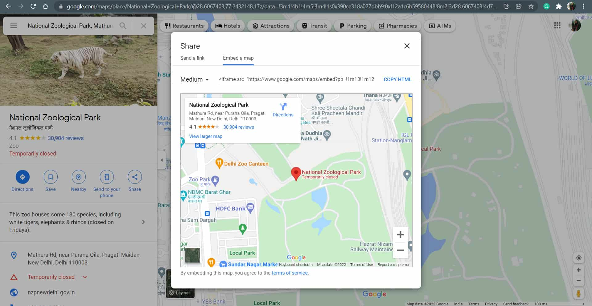

# short-map

## Short Map

### Introduction

[https://github.com/vietphan1995/short-map.git](https://github.com/vietphan1995/short-map.git)

✉️ [Send to email: vietphan95@outlook.com](mailto:vietphan95@outlook.com?subject=register_idea:short-map_project&body=left_your_idea)

Short Map is a software platform which brings better experience for user in embedding side by preview image/s, widget integration.

Short Map admin board helps import map information from other services and extract it to Short Map styles which user can design as responsive mode, view size, 2d/3d/color/indicator … as map content, image/s to popup/expand and collapse as widget types.

Short Map widget can config user behavior from embedding side, improve scroll, swipe, click/press, gesture on embedding side.

.

### [back to git projects …](https://github.com/vietphan1995/projects)

### Notes
https://phantrungviet.notion.site/short-map-1b25e832d6ee80238ce0eadfaebdd542